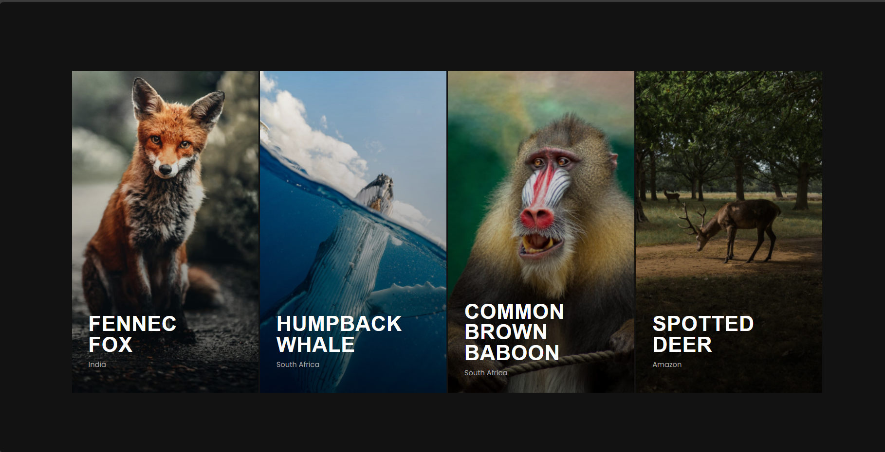

> # Code Of Africa Challenge

## Overview

This repository contains my submission for the Interactive Photo Gallery challenge. The goal was to build an interactive photo gallery based on provided Figma designs and complete two coding challenges using JavaScript.

- #### Duration: 6 Hours
- #### Due Date: 06th June, 2024

# Interactive Photo Gallery Challenge



> # How to Run the Project

## Installation

#### start:

1. Clone the repository:

```bash
   git clone https://github.com/tchamianest/codeOfAfricaChallenge
```

2. Navigate to the project directory:

```bash
  cd codeOfAfricaChallenge
```

2. Open index.html in your browser to view the interactive photo gallery:

```bash
   open file into  liveserver
```
# Language  

- ### javascript
- ### HTML
- ### CSS


# Contact Me

If you have any questions or need more explanation , please don't hesitate to reach out to me:

- ### Email: tchamianest@gmail.com
- ### LonkedIn: [Click Here](https://www.linkedin.com/in/iradukunda-ernest-391bb7272/)
- ### Phone: +250 789 696 745
- ### Whatsapp: [Whatsapp](https://wa.me/message/DIJQRHQVTQC5D1)


